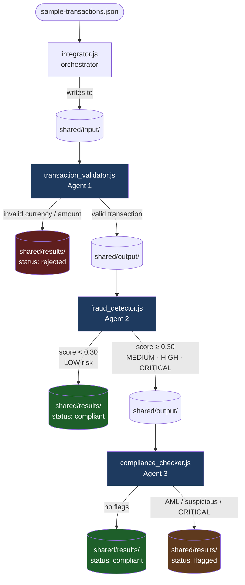

# Homework 6: AI-Powered Multi-Agent Banking Pipeline

**Author: Ruslan Formanchuk**  
**Date:** June 2026  
**AI Tools Used:** Cursor (Claude Sonnet 4.6) — Plan Mode + Agent Mode

---

## What this is

A multi-agent transaction processing pipeline where four AI meta-agents collaborate to
build a complete banking system from scratch: one writes the specification, one generates
the code, one creates tests with a coverage gate, and one produces this documentation.

The resulting pipeline processes raw banking transactions through three cooperating Node.js
agents — validator, fraud detector, and compliance checker — writing structured JSON results
to a shared filesystem. A FastMCP server makes the pipeline queryable via MCP tools.

---

## Pipeline Architecture



---

## Four Meta-Agents

| Agent | Role | Key deliverable |
|-------|------|-----------------|
| **Agent 1 — Specification** | Writes the technical spec from template | `specification.md`, `agents.md`, `/write-spec` skill |
| **Agent 2 — Code Generation** | Builds the pipeline using context7 MCP | `agents/*.js`, `integrator.js`, `research-notes.md` |
| **Agent 3 — Unit Tests** | Creates test suite with coverage gate | `tests/`, `.cursor/hooks.json`, `jest.config.js` |
| **Agent 4 — Documentation** | Generates README and HOWTORUN | `README.md` (this file), `HOWTORUN.md` |

---

## Pipeline Agents

| Agent | Input | Decision logic | Output |
|-------|-------|----------------|--------|
| `transaction_validator.js` | `shared/input/` | Required fields, positive Decimal amount, ISO 4217 currency | valid → `output/`, invalid → `results/` (rejected) |
| `fraud_detector.js` | `shared/output/` | Risk scoring: high_value (+0.60), structuring (+0.30), unusual_hour (+0.20), cross_border (+0.15) | LOW → `results/` (compliant), elevated → `output/` |
| `compliance_checker.js` | `shared/output/` | AML threshold ($10k), suspicious accounts, CRITICAL risk flag | All → `results/` (compliant or flagged) |

---

## Tech Stack

| Tool | Version | Purpose |
|------|---------|---------|
| Node.js | 18+ | Pipeline agents and orchestrator |
| `decimal.js` | ^10.4.3 | Monetary arithmetic (never native float) |
| Jest | ^29.7.0 | Unit and integration tests |
| ESLint | ^9.39.4 | Code style enforcement |
| Python 3.11+ | — | FastMCP server (`mcp/server.py`) |
| FastMCP | ^2.0.0 | Custom MCP server (pipeline-status) |
| context7 | latest | Framework documentation lookup during development |

---

## Quick Start

```bash
cd homework-6
npm install
node integrator.js       # run full pipeline
npm test                 # run tests with coverage (gate: 80%)
npm run validate         # dry-run validation only
```

---

## Sample Results (8 transactions)

| TXN | Amount | Status | Reason |
|-----|--------|--------|--------|
| TXN001 | $1,500 USD | compliant | LOW risk |
| TXN002 | $25,000 USD | **flagged** | aml_reporting_required |
| TXN003 | $9,999.99 USD | **flagged** | suspicious_destination (ACC-9999) |
| TXN004 | $500 EUR | compliant | MEDIUM risk, no compliance flags |
| TXN005 | $75,000 USD | **flagged** | aml_reporting_required |
| TXN006 | $200 XYZ | **rejected** | Invalid ISO 4217 currency: XYZ |
| TXN007 | -$100 GBP | **rejected** | Amount must be positive |
| TXN008 | $3,200 USD | compliant | LOW risk |

---

## MCP Servers

| Server | Type | Command | Exposes |
|--------|------|---------|---------|
| `context7` | Remote | `npx @upstash/context7-mcp@latest` | Library documentation lookup |
| `pipeline-status` | stdio | `python mcp/server.py` | `get_transaction_status`, `list_pipeline_results`, `pipeline://summary` |

---

## Coverage Gate

`npm test` fails automatically if coverage drops below 80% (configured in `jest.config.js`).
The Cursor hook in `.cursor/hooks.json` intercepts `git push` and runs tests first.

Current coverage: **92%+ lines, 82%+ branches**

---

## Screenshots

| Screenshot | Description |
|------------|-------------|
| `docs/screenshots/pipeline-run.png` | Full terminal output of `node integrator.js` |
| `docs/screenshots/test-coverage.png` | Jest coverage report ≥ 80% |
| `docs/screenshots/skill-run-pipeline.png` | `/run-pipeline` skill executing in Cursor |
| `docs/screenshots/hook-trigger.png` | Coverage gate hook firing on `git push` |
| `docs/screenshots/mcp-interaction.png` | context7 query + `get_transaction_status` tool call |
